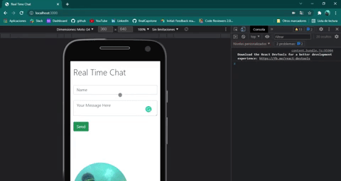

# Real time Chat

> Application that sends and shows messages to a recipient instantly without any page refresh. 



## Built With

- BackEnd:
  - Node.js & Express: server
  - MongoDB  Mongoose: database
  - Socket.io: sockets
- FrontEnd:
  - Html
  - JQuery
  - Socket.io: sockets

## Getting Started

To get a local copy up and running follow these simple example steps.

### Prerequisites

- Node.js
- No-SQL database: MongoDB (Se how to use it on the [official documentation](https://docs.mongodb.com/)

### Setup
```
git clone https://github.com/petudeveloper/real-time-chat.git
```
### Install
```
npm i
```
### Usage
Visit on tour broswer
```
http://localhost:3000/
```

## Authors

👤 **David Alvarez**

- GitHub: [@petudeveloper](https://github.com/petudeveloper)
- Twitter: [@petudeveloper](https://twitter.com/petudeveloper)
- LinkedIn: [David Alvarez Mazzo](https://www.linkedin.com/in/davidalvarezmazzo/)

## 🤝 Contributing

Contributions, issues, and feature requests are welcome!

Feel free to check the [issues page](../../issues/).

## Show your support

Give a ⭐️ if you like this project!

## Acknowledgments

- Hat tip to anyone whose code was used
- Inspiration
- etc

## 📝 License

This project is [MIT](./MIT.md) licensed.

